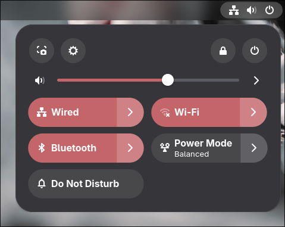
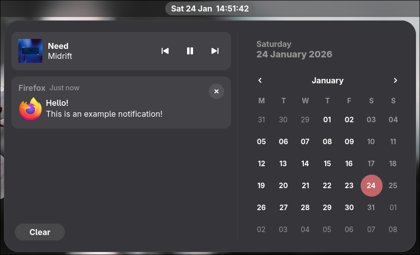
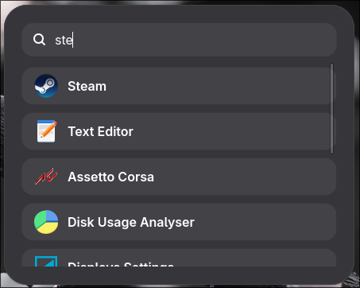
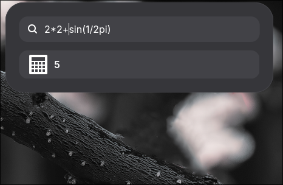
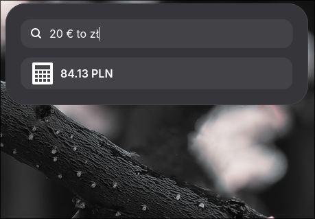
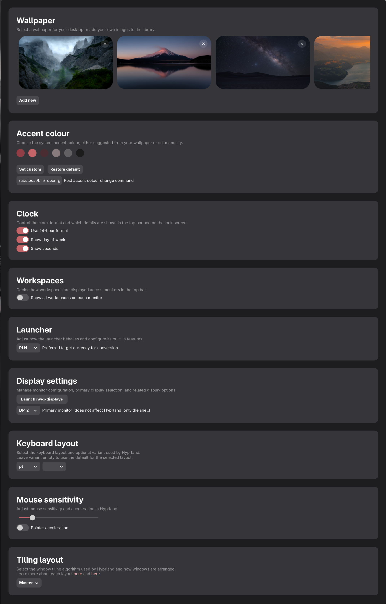
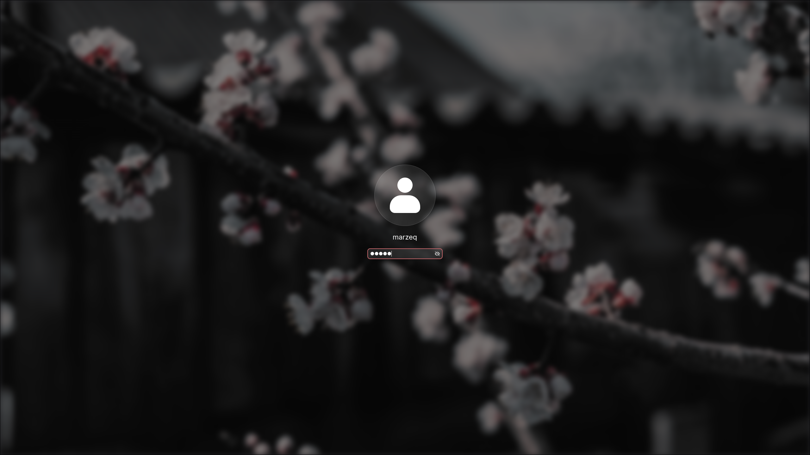

# dotfiles

This is my personal dotfiles repository for Hyprland, Neovim, and other applications.

The Hyprland configuration is a faithful adaptation of how the GNOME desktop environment looks and feels,
while preserving the superior ergonomics of a tiler like Hyprland. All design credits go to the GNOME team where due.

The Neovim setup is my personal balance between minimalism and IDE-like usability, so I get all of the modern features
I deem necessary without the bloat and unresponsiveness.

## Installation

Instructions [here](./INSTALL.md).

## Notes/documentation/keybindings

[Here](./NOTES.md).

## Gallery

### Hyprland desktop

### Neovim

