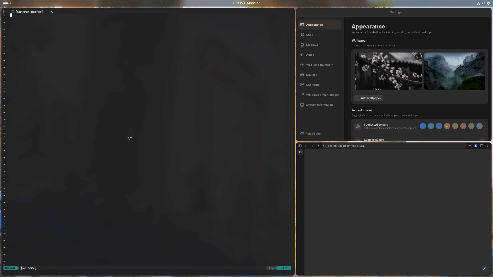
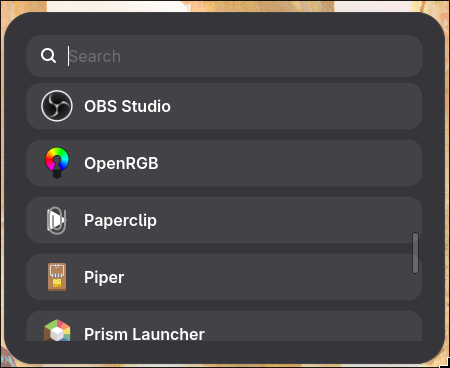
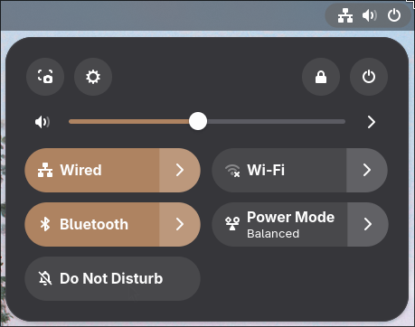
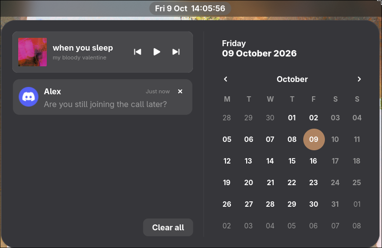
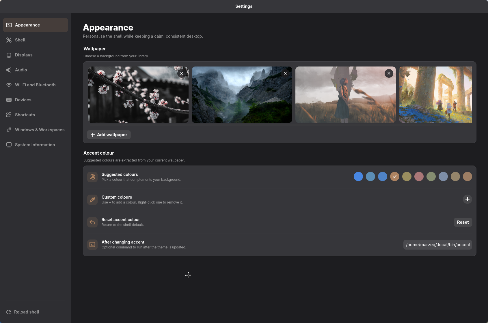
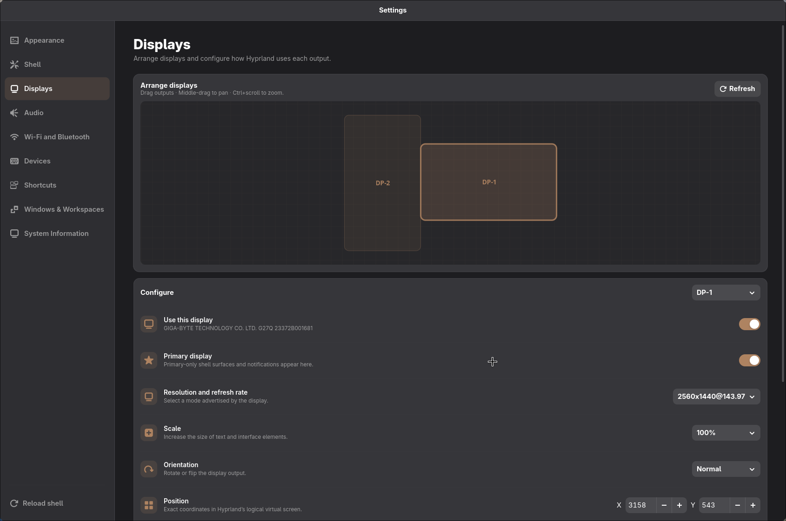
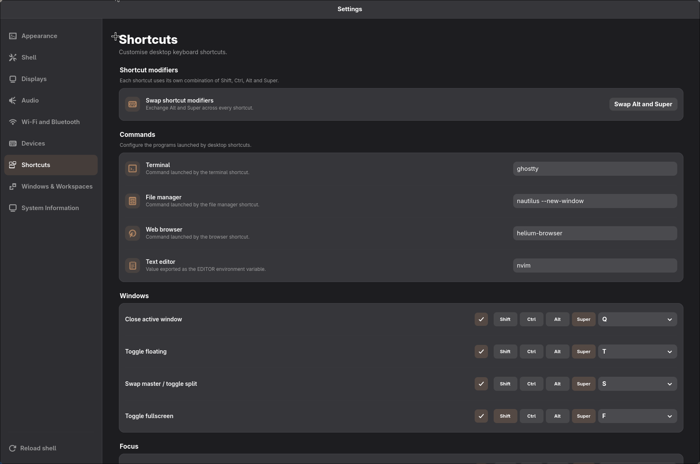

# dotfiles

This is my personal dotfiles repository for Hyprland, Neovim, and other applications.

Every component is opt-in. Using only the desktop, only Neovim, only the shell configuration, or any combination of
components is supported and encouraged; there is no need to adopt the entire setup.

## Components

- **Desktop** — Hyprland with a custom GNOME-inspired shell and graphical settings.
- **Neovim** — a ready-to-use configuration balancing minimalism with modern IDE features.
- **Shells** — a shared Bash and Zsh environment.
- **Terminal** — Ghostty configuration and its accompanying font.

## Installation

Start with the **[managed installation](./INSTALL.md#managed-installation-recommended)** on Arch Linux x86-64. It is the
easiest way to install one or more components and keep them updated.

Using another distribution or macOS? See the
**[advanced manual instructions](./ADVANCED.md)** instead. Existing users of the old installer should follow the
**[migration guide](./MIGRATION.md)**.

## Notes/info for customisation

[Here](./NOTES.md).

## Desktop overview

The Hyprland configuration is a faithful adaptation of how the GNOME desktop environment looks and feels, while
preserving the superior ergonomics of a tiler like Hyprland. All design credits go to the GNOME team where due.

### Launcher

The unified launcher searches installed applications and also provides calculator, currency-conversion and power-action
modes.

### Control centre

Frequently used audio, network, Bluetooth, power-profile and session controls are available from the status area without
leaving the current workspace. Just like GNOME.

### Notifications and calendar

The clock opens a combined view for media controls, notifications and the calendar. Again, just like GNOME.

### Integrated settings

Shell appearance, display arrangement and Hyprland behavior can be configured graphically.

I share GNOME's “do not break colours” philosophy: personalisation should preserve the contrast and visual hierarchy
designed into the interface. The shell still offers more extensive accent-colour customisation than GNOME itself,
including wallpaper-derived suggestions and arbitrary custom colours. Suggested accents are chosen with legibility in
mind, while custom colours remain available for people who want full control.

Displays can be arranged and configured without editing the Hyprland configuration by hand. You don't often see this in a tiler,
do you :)?

Hyprland shortcuts can be enabled, disabled and remapped individually.

Of course, the settings window has more sections than shown here.

## Neovim

The Neovim setup is my personal balance between minimalism and IDE-like usability, providing the modern features I need
without the bloat and unresponsiveness.

